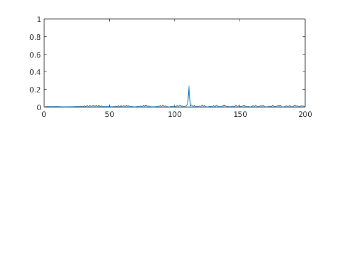
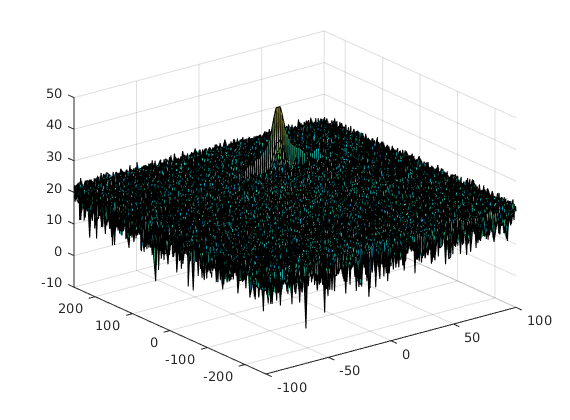
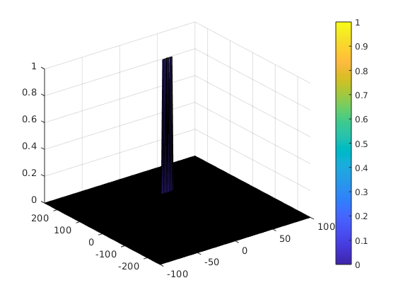

# Project: Radar Target Generation and Detection

#### FMCW Waveform Design
##### Using the given system requirements, design a FMCW waveform. Find its Bandwidth (B), chirp time (Tchirp) and slope of the chirp.

``` matlab
b_sweep = speed_of_light / (2 * range_resolution);
sweep_time_factor = 5.5;
Tchirp = sweep_time_factor * (2 * max_range / speed_of_light);
slope = b_sweep / Tchirp;
```

#### Simulation Loop
##### Simulate Target movement and calculate the beat or mixed signal for every timestamp.

``` matlab
for i=1:length(t)         
    
    %For each time stamp update the Range of the Target for constant velocity. 
    r_t(i) = (targets_velocity * t(i)) + targets_position;
    td(i) = (2*r_t(i)) / speed_of_light;
    % *%TODO* :
    %For each time sample we need update the transmitted and
    %received signal. 
    Tx(i) = cos(2 * pi * (fc * t(i) + (slope * t(i) ^ 2) / 2.0));
    Rx(i) = cos(2 * pi * (fc * (t(i) - td(i)) + (slope * (t(i) - td(i)) ^ 2) / 2.0));

    
    %Now by mixing the Transmit and Receive generate the beat signal
    %This is done by element wise matrix multiplication of Transmit and
    %Receiver Signal
    Mix(i) = Tx(i).*Rx(i);
    
end
```

#### Range FFT (1st FFT)
##### Implement the Range FFT on the Beat or Mixed Signal and plot the result.

```matlab
%reshape the vector into Nr*Nd array. Nr and Nd here would also define the size of
%Range and Doppler FFT respectively.
Mix = reshape(Mix, [Nr, Nd]);
 % *%TODO* :
%run the FFT on the beat signal along the range bins dimension (Nr) and
%normalize.
signal_fft = fft(Mix,Nr);
signal_fft = signal_fft/Nr;

% Take the absolute value of FFT output
signal_fft = abs(signal_fft);

 % *%TODO* :
% Output of FFT is double sided signal, but we are interested in only one side of the spectrum.
% Hence we throw out half of the samples.
signal_fft = signal_fft(1:Nr/2);

% plotting the range
figure ('Name','Range from First FFT')
subplot(2,1,1)

 % *%TODO* :
 % plot FFT output 
plot(signal_fft);
```



#### 2D CFAR
##### Implement the 2D CFAR process on the output of 2D FFT operation, i.e the Range Doppler Map.



``` matlab
% *%TODO* :
%Select the number of Training Cells in both the dimensions.
Tr = 10;
Tc = 8;
% *%TODO* :
%Select the number of Guard Cells in both dimensions around the Cell under 
%test (CUT) for accurate estimation
Gr = 4;
Gc = 4;
% *%TODO* :
% offset the threshold by SNR value in dB
offset = 10;
% *%TODO* :
%Create a vector to store noise_level for each iteration on training cells
noise_level = zeros(1,1);


% *%TODO* :
%design a loop such that it slides the CUT across range doppler map by
%giving margins at the edges for Training and Guard Cells.
%For every iteration sum the signal level within all the training
%cells. To sum convert the value from logarithmic to linear using db2pow
%function. Average the summed values for all of the training
%cells used. After averaging convert it back to logarithimic using pow2db.
%Further add the offset to it to determine the threshold. Next, compare the
%signal under CUT with this threshold. If the CUT level > threshold assign
%it a value of 1, else equate it to 0.
[rows_RDM, cols_RDM] = size(RDM);

   % Use RDM[x,y] as the matrix from the output of 2D FFT for implementing
   % CFAR
% RDM = RDM/max(max(RDM));
RDM_pow = db2pow(RDM);

for i=Tr+Gr+1: (Nr/2) -(Tr+Gr)
    for j=Tc+Gc+1: Nd -(Tc+Gc)
        window_sum = zeros(1,1);
        for m = i-(Tr+Gr):i+(Tr+Gr)
            for n = j-(Tc+Gc):j+(Tc+Gc)
                 if((abs(i-m) > Gr) || (abs(j-n) > Gc))
                        window_sum = window_sum + RDM_pow(m,n);   
                 end
            end
        end
        avg = window_sum / ((2*(Tc+Gc+1)*2*(Tr+Gr+1)-(Gr*Gc)-1));
        threshold = pow2db(avg) + offset;
        CUT = RDM(i,j);
        if(CUT > threshold)
            RDM(i,j) = 1;
        else
            RDM(i,j) = 0;
        end
    end
end


% *%TODO* :
% The process above will generate a thresholded block, which is smaller 
%than the Range Doppler Map as the CUT cannot be located at the edges of
%matrix. Hence,few cells will not be thresholded. To keep the map size same
% set those values to 0. 
 
for i=1:Tr+Gr
    RDM(i, :) = 0;
    RDM(Nr/2-i-1:Nr/2, :) = 0;
end
for i=1:Tc+Gc
    RDM(:, i) = 0;
    RDM(:, Nd-i-1:Nd) = 0;
end


% RDM(union(1:(Tr+Gr),end-(Tr+Gr-1):end),:) = 0;  % Rows
% RDM(:,union(1:(Tc+Gc),end-(Tc+Gc-1):end)) = 0;  % Columns 
% *%TODO* :
%display the CFAR output using the Surf function like we did for Range
%Doppler Response output.
figure('Name','CA-CFAR Filtered RDM'),surf(doppler_axis,range_axis,RDM);
colorbar;
```



